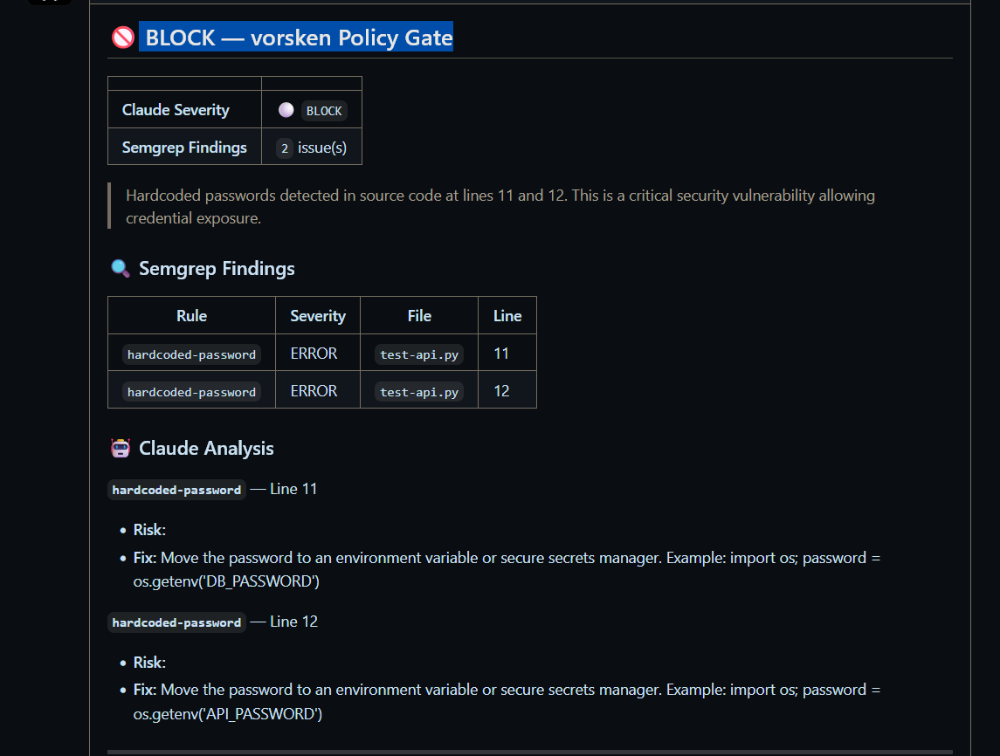

# vorsken

[](https://github.com/zetide/vorsken/releases/latest)
[](https://github.com/marketplace/actions/vorsken-policy-gate)
> **The policy gate between AI-generated code and your main branch.**
>
> Works regardless of which AI tool generated the code (Cursor, Copilot, Aider, Claude Code, etc.), and regardless of which in-session security tools were active. vorsken enforces policy at merge time — complementing in-session guidance, not replacing it.

Semgrep scans the diff. Claude explains each finding in plain English. The verdict — **BLOCK / FLAG / PASS** — is posted on the PR, and a `BLOCK` fails the required check and stops the merge.

[](https://github.com/zetide/vorsken/actions/workflows/ci.yml)
[](https://github.com/zetide/vorsken)
[](LICENSE)
[](https://owasp.org/API-Security/)
[](https://dev.to/vorsken/stop-merging-vulnerable-api-code-automate-pr-security-gates-with-semgrep-claude-ai-22ik)

---

## What It Does

### What a BLOCK looks like



> The PR comment shows verdict, OWASP category, risk explanation,
> and a concrete fix — without leaving GitHub.

vorsken is a GitHub Action that acts as a **security policy enforcement layer** on pull requests.

PR opened / updated
└─▶ Semgrep scans changed files with OWASP API Top10 rules
└─▶ Claude AI analyzes findings and generates an English report
└─▶ Verdict posted as a PR comment: BLOCK / FLAG / PASS
└─▶ BLOCK verdict fails the required check → merge is prevented

text

**Why this, not just Semgrep alone?**
Semgrep gives you rule IDs and line numbers. vorsken adds Claude AI context:
what the vulnerability means, which OWASP category it maps to, and a concrete fix suggestion — all in the PR comment, without leaving GitHub.

---

## Quick Start

### 1. Add the workflow file

Create `.github/workflows/vorsken.yml` in your repository:

```yaml
name: vorsken Policy Gate

on:
  pull_request:
    branches: [main]

jobs:
  policy-gate:
    runs-on: ubuntu-latest
    permissions:
      pull-requests: write # required to post PR comments
      contents: read

    steps:
      - uses: actions/checkout@v4

      - uses: zetide/vorsken@v0.2.6
        with:
          anthropic-api-key: ${{ secrets.ANTHROPIC_API_KEY }}
```

### 2. Add your Anthropic API key

Go to **Settings → Secrets and variables → Actions** and add:

ANTHROPIC_API_KEY = sk-ant-...

text

### 3. Open a pull request

That's it. vorsken will automatically scan, analyze, and comment on every PR.

---

## Where vorsken Fits

AI coding tools increasingly ship their own in-session security review — Anthropic's [security-guidance plugin](https://code.claude.com/docs/en/security-guidance), for one, flags risky patterns while Claude Code writes them. vorsken doesn't replace those tools. It runs one layer further down, at the merge gate.

Anthropic describes AI-assisted security as defense in depth across four stages:

| Stage | Typical tool | Role |
| --- | --- | --- |
| In session | In-editor review (e.g. the Claude Code security-guidance plugin) | Flags and fixes issues as the code is written |
| On demand | `/security-review`-style scans | A one-off pass when a developer asks for it |
| On pull request | Plan-gated multi-agent PR review | Correctness + security review with codebase context |
| **In CI** | **Static analysis, dependency scanning, and policy enforcement** | **Hard gates on every change — whoever or whatever wrote it** |

The in-session layers are guidance: they advise rather than block, and they only see code written through that one tool — not code from Cursor, Copilot, Aider, a teammate, or a human. Anthropic's own model leaves policy enforcement to the CI stage. That's where vorsken runs.

vorsken is the **In CI** layer:

- **Enforcing, not advisory** — a `BLOCK` verdict fails the required check and stops the merge.
- **Tool- and plugin-agnostic** — it evaluates the diff, not the editor. Any AI tool, any IDE, or a human is gated the same way.
- **Declarative policy** — `.vorsken.yml` defines what blocks, so the gate is auditable and version-controlled, not a setting in someone's editor.
- **MIT, every plan** — no Team/Enterprise tier required.

Use the in-session tools to catch issues early. Use vorsken so the ones that slip through never reach `main`.

---

## PR Comment Example

🚨 vorsken Policy Gate — BLOCK

Summary: A hardcoded API key and an SSRF vulnerability were detected.
Merge is blocked until these issues are resolved.
Severity Rule OWASP Category Recommendation
🔴 HIGH hardcoded-api-key API8:2023 Security Misconfiguration Move credentials to environment variables.
🔴 HIGH ssrf-requests API7:2023 SSRF Validate and allowlist external URLs before requests.

text

---

## Configuration

Create `.vorsken.yml` in your repository root to customize behavior:

```yaml
policy:
  block_on: ["ERROR", "CRITICAL", "HIGH"]
  flag_on: ["WARNING", "MEDIUM"]

claude:
  model: "claude-haiku-4-5" # or claude-sonnet-4-5 for deeper analysis

rules:
  overrides:
    - rule_id: "hardcoded-password"
      action: "BLOCK"
```

### All inputs

| Input               | Required | Default        | Description                     |
| ------------------- | -------- | -------------- | ------------------------------- |
| `anthropic-api-key` | ✅       | —              | Anthropic API key for Claude    |
| `github-token`      | —        | `github.token` | GitHub token for PR comments    |
| `semgrep-rules`     | —        | `rules/custom` | Path to Semgrep rules directory |
| `target-path`       | —        | `.`            | Path to scan                    |
| `config-path`       | —        | `.vorsken.yml` | Path to config file             |
| `block-on-error`    | —        | `true`         | Exit code 1 on BLOCK verdict    |

### Output

| Output    | Description                 |
| --------- | --------------------------- |
| `verdict` | `BLOCK` \| `FLAG` \| `PASS` |

---

## OWASP API Security Top 10 (2023) Coverage

| #     | Risk                                            | Rule File                                          | Status |
| ----- | ----------------------------------------------- | -------------------------------------------------- | ------ |
| API1  | Broken Object Level Authorization               | — (no dedicated rule)                              | —      |
| API2  | Broken Authentication                           | `api2_broken_auth.yml`                             | ✅     |
| API3  | Broken Object Property Level Authorization      | `api3_mass_assignment.yml`                         | ✅     |
| API4  | Unrestricted Resource Consumption               | `api4_resource_limit.yml`                          | ✅     |
| API5  | Broken Function Level Authorization             | `api5_func_authz.yml`                              | ✅     |
| API6  | Unrestricted Access to Sensitive Business Flows | `api6_business_flow.yml`                           | ✅     |
| API7  | Server Side Request Forgery (SSRF)              | `ssrf.yml`                                         | ✅     |
| API8  | Security Misconfiguration                       | `api8_debug_mode.yml`, `api8_hardcoded_secret.yml` | ✅     |
| API9  | Improper Inventory Management                   | `api9_inventory.yml`                               | ✅     |
| API10 | Unsafe Consumption of APIs                      | `api10_unsafe_api.yml`                             | ✅     |

> **API1 — Broken Object Level Authorization (BOLA):** no dedicated rule. Object-level authorization is contextual — it depends on which user owns the record being accessed — so a pure-policy Semgrep pattern produces too many false positives to gate on; BOLA is left to Claude's contextual review instead. The f-string SQL pattern that the former API1 rule incidentally matched has been relabeled and moved into the generic `sql-injection` rule (CWE-89) — see [Additional Hardening Rules](#additional-hardening-rules).
>
> **API7 — SSRF:** `ssrf-via-requests` is `severity: WARNING`, so it maps to **FLAG**, not BLOCK. It is a coarse gate that routes outbound `requests` calls to human review: a pure-policy rule cannot distinguish a validated or allowlisted URL from a dangerous one, so it deliberately flags for a human rather than blocking the merge.

---

## Additional Hardening Rules

Beyond the OWASP API Top 10, `rules/custom` ships general hardening rules that carry **no OWASP API number**. Most map to the A03:2021 - Injection family and run against all scanned Python. `severity` maps to the policy gate verdict (`ERROR` → BLOCK, `WARNING` → FLAG).

| Rule ID                 | Detects                                                                                  | Rule File                  | CWE              | Severity → Verdict |
| ----------------------- | ---------------------------------------------------------------------------------------- | -------------------------- | ---------------- | ------------------ |
| `sql-injection`         | Dynamic SQL (f-string, `+`, `%`, or `.format()`) passed to `execute()` / `executemany()` | `sql_injection.yml`        | CWE-89           | `ERROR` → BLOCK    |
| `subprocess-shell-true` | `subprocess.run` / `Popen` / `call` / `check_call` / `check_output` with `shell=True`    | `subprocess_injection.yml` | CWE-78           | `ERROR` → BLOCK    |
| `code-execution`        | `exec()`, `compile()`, `pickle.load()`, `pickle.loads()`                                 | `code_execution.yml`       | CWE-94 / CWE-502 | `ERROR` → BLOCK    |
| `eval-injection`        | `eval(...)`                                                                               | `eval_injection.yml`       | —                | `ERROR` → BLOCK    |
| `hardcoded-password`    | Hardcoded `password` / `secret` / `api_key` literal                                      | `hardcoded_password.yml`   | —                | `ERROR` → BLOCK    |

---

## Local Development

```bash
git clone https://github.com/zetide/vorsken.git
cd vorsken
pip install -e .

# Run tests
pytest --cov -v

# Lint and type check
ruff check src/
mypy src/stacksecai --ignore-missing-imports

# Run Semgrep manually
semgrep --config rules/custom tests/fixtures/vulnerable_sample.py
```

---

## Requirements

- Python 3.11+
- [Anthropic API key](https://console.anthropic.com/)
- GitHub Actions runner (ubuntu-latest recommended)

---

## Privacy

Changed files in PRs are sent to Anthropic's Claude API for analysis.
No data is stored or logged by vorsken.
By using this Action, you agree to [Anthropic's usage policies](https://www.anthropic.com/legal/usage-policy).

## Disclaimer

This tool uses AI analysis and may produce false positives or miss vulnerabilities.
Results should be reviewed by a human before taking action.
The authors are not responsible for any security incidents arising from use of this tool.

## License

MIT — see [LICENSE](LICENSE).

---

## About

Built by **[zetide](https://github.com/zetide)** —
a security observability platform for API-first teams.

> _"Shift security left — before the merge, not after the breach."_
